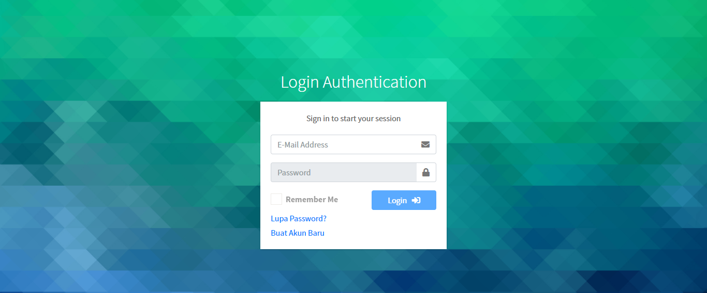
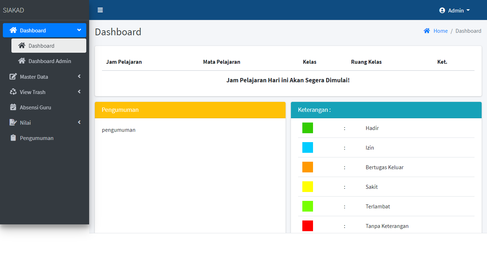
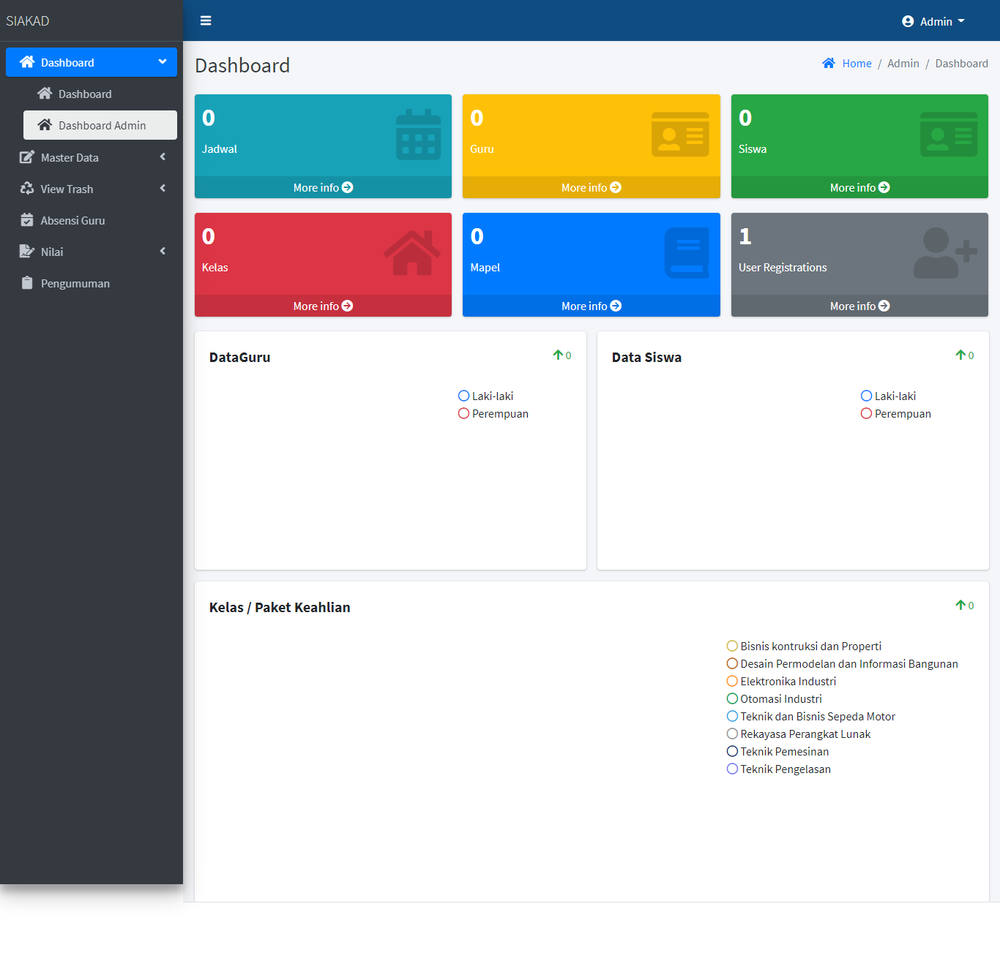
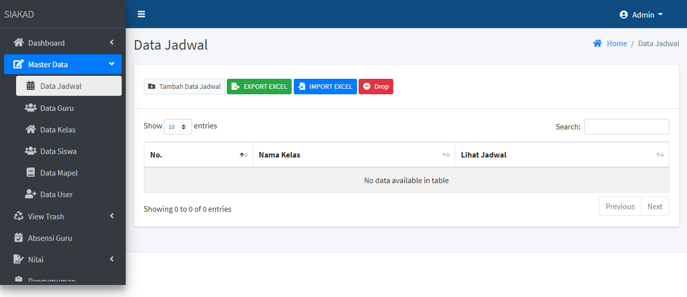
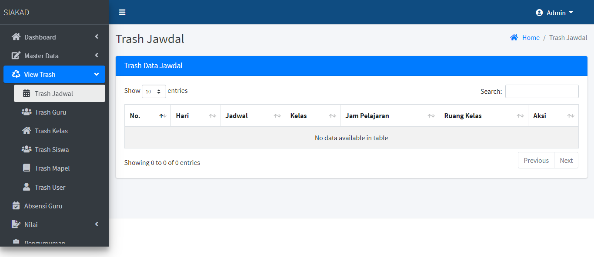
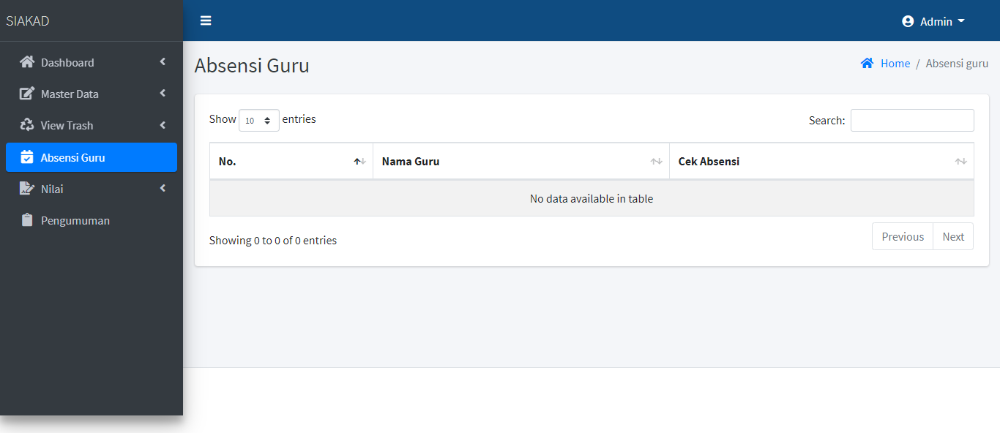
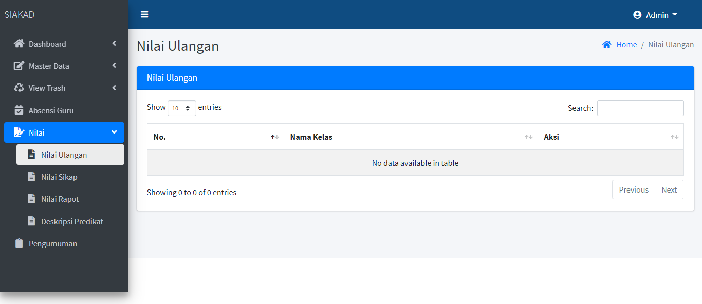
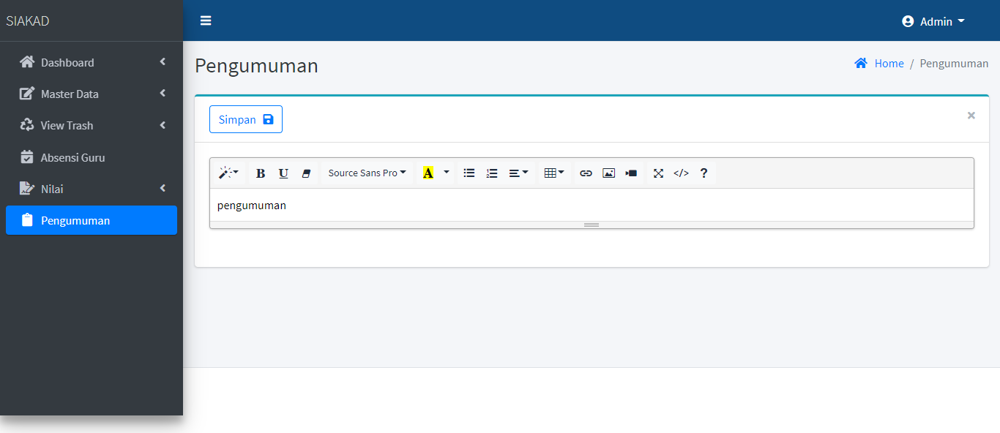

</a> **Sistem Informasi Akademik Sekolah adalah Website untuk para siswa dapat melihat jadwal pelajaran, dan nilai rapot dan para guru dapat menambahkan nilai siswa dengan muda melalui website.**

## Fitur apa saja yang tersedia di Sistem Informasi Akademik Sekolah?

- Autentikasi Admin
- User & CRUD
- Jadwal & CRUD
- Kelas & CRUD
- Mata Pelajaran & CRUD
- Guru & CRUD
- Siswa & CRUD
- Rapot
- Dan lain-lain
# Screenshot
*Halaman login

</b>Dashboard

*Dashboard Admin

*Master Data

*Trash

*Absensi Guru

*Nilai

*Pengumuman

